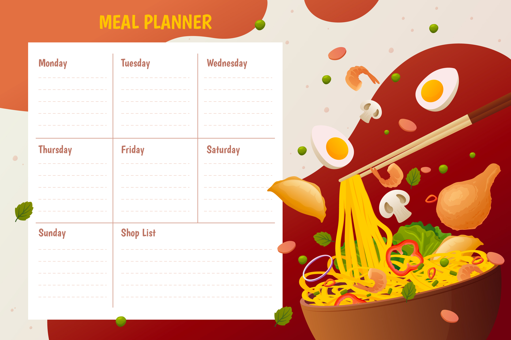

# voyage-project-tier2-menu-scheduler

## Table of Contents

* [Overview](#overview)
* [General Instructions](#general-instructions)
* [Requirements & Specifications](#requirements-specifications)
* [Acknowledgements](#acknowledgements)
* [About Chingu](#about-chingu)

## Overview

Welcome, Chingus!

This project focuses on developing a menu scheduling application that allows managers to create and share weekly menus for staff workers. The application ensures employees have clear visibility of the planned meals while addressing specific dietary restrictions and allergies.

In this voyage, your team will design and build an intuitive web application to simplify menu planning and ensure inclusivity for all employees, leveraging dishes API.

## General Instructions

This project is designed to be worked on by a team rather than an individual
Chingu. This means you and your team will need to thoroughly read and
understand the requirements and specifications below, **_and_** define and
manage your project following the _Agile Methodology_ defined in the
[Voyage Handbook](https://github.com/chingu-voyages/Handbook/blob/main/docs/guides/voyage/voyage.md#voyage-guide).

As you create this project make sure it meets all of the requirements, but once
it reaches MVP, start implementing the optional features or get creative and
extend it in ways we haven't envisioned. In other words, use the power of
teamwork to make it distinctive and unique.

Remember, UI/UX creativity is yours to explore—design an interface that stands out while ensuring ease of use.

## Requirements & Specifications

### What You Need to Do

The following define the minimum requirements and ideas for features you may
implement to enhance this app, if time permits.

#### Structure

- [ ] This is a purely frontend application. No backend is required.
- [ ] You may use any languages, tools, or libraries you prefer when designing and building this app.
- [ ] You may **_NOT_** use AI-based solution generators like GitHub Copilot.
- [ ] Useful links and resources:
  - [Print React Component](https://www.npmjs.com/package/react-to-print)
  - [Dishes API](https://menus-api.vercel.app/dishes)

#### Styling

- [ ] Surprise us!!! Use your team's creativity to make this app distinctive.
- [ ] Add a footer containing a link to your team's GitHub repo.
- [ ] In general, you will find these [UI design principles](https://www.justinmind.com/ui-design/principles) helpful.
- [ ] Recommend using this resource for [clean CSS](https://israelmitolu.hashnode.dev/writing-cleaner-css-using-bem-methodology).

#### Functionality
- Application Overview

  - [ ] Develop a responsive single-page application (SPA) to facilitate weekly menu scheduling.
  - [ ] Ensure the application is user-friendly, accessible, and visually appealing.

- Allergy Input and Management

  - [ ] Enable managers to input workers' allergies directly within the app using a user-friendly form or interface.
  - [ ] Allow multiple allergy inputs, with the option to save and manage them for future menu planning.
  - [ ] Automatically filter out dishes containing allergens based on workers' allergy data items.
  
- Week Scheduling

  - [ ] Provide managers with the ability to schedule menus for a specific week using:
    - Date Picker: A calendar interface for seamless week selection.
    - Default Option: Automatically pre-select the upcoming week for scheduling.
    - Manual Input: Allow managers to specify the start and end dates of the week.

  - [ ] Define the weekly menu structure as a 7-day period starting on Monday and ending on Sunday.

- Dish Management

  - [ ] Dish Assignment

    - Enable managers to assign dishes for each day of the week

      - [ ] Automatically generate a menu with one unique dish for each day using [dishes API](https://menus-api.vercel.app/dishes).
      - [ ] Write a logic to randomly select and assign unique dish for each day of the week.
      - [ ] Implement a regenerate weekly menu feature.

    - "Day Off" Feature

      - [ ] Enable marking specific weekdays as "Day Off", where no dish is assigned.
  
  - [ ] Data Requirements

    - Source dishes from the [dishes API](https://menus-api.vercel.app/dishes) containing the following details:

      - Dish Name: Unique identifier for each dish.
      - Ingredients: List of ingredients used.
      - Calories: Nutritional value of the dish.

  - [ ] Allergen Restrictions

    - Cross-reference the stored workers' allergies data to prevent scheduling dishes containing allergens.

- Validation and Error Handling

  - [ ] Ensure menus are created only for the current week or future weeks
  - [ ] Display an error message for invalid inputs (e.g., selecting past weeks or overlapping scheduling entries).
  - [ ] Prohibit duplicate dish assignments for the same week
  - [ ] Provide clear error messages when duplicates are detected.

- Data Persistence

  - [ ] Implement local storage to save allergies data in the browser

- User Interface and Experience (UI/UX)

  - [ ] Present the finalized weekly menu in an intuitive and readable format, such as (table view, calendar-like grid) suprise us :).
  - [ ] Ensure the application is fully responsive and adapts to various devices and screen sizes.

- Data Export

  - [ ] Add functionality for managers to download or export the finalized weekly menu as a PDF or Excel file.
        
### Extras (Not Required)

  - [ ] Enable users to edit and delete an allergy

## Acceptance Criteria

  - [ ] Users can create workers' allergies

  - [ ] Users can successfully create a valid weekly menu with:
    - Unique dishes.
    - Exclusion of allergenic options.
    - Specified days off.
        
  - [ ] The UI provides clear feedback for invalid inputs (e.g., duplicate dishes, allergen violations).
  - [ ] The weekly menu is displayed in a clean, accessible format.

## Acknowledgements

We would like to express our profound gratitude to the global developer community, whose collaborative spirit and shared knowledge continually motivate and enrich our endeavors. Together, we achieve extraordinary milestones. Thank you.

## About Chingu

If you aren't yet a member of Chingu we invite you to join us. We help our
members transform what they've learned in courses & tutorials into the
practical experience employers need and want.
